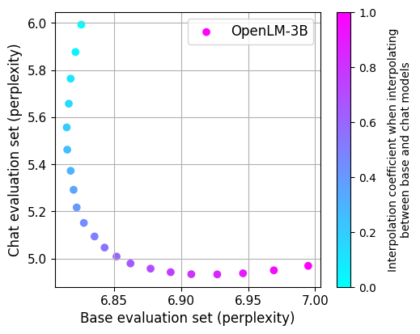

# Instruction tuning and weight averaging

Note that some of these stpes may be out of date, but the general flow should remain.

We downloaded the data from https://huggingface.co/datasets/timdettmers/openassistant-guanaco then ran `python datapreprocess/make_assistant_data.py --input-files /fsx/home-mitchellw/openassistant_best_replies_train.jsonl --output-dir /fsx/home-mitchellw/tmp --num-workers 1 --num-consumers 1`. Note that we changed shard size so there would be at least 8 shards.

```
torchrun --nproc-per-node 8 -m open_lm.main \
    --train-data "pipe:aws s3 cp s3://<bucket>/lmdata/assistant_data/train/shard-{0000000..0000008}.tar -" \
    --train-num-samples 4382720 \
    --workers 1 \
    --precision amp_bfloat16 \
    --batch-size 8 \
    --grad-checkpointing \
    --log-every-n-steps 1 \
    --grad-clip-norm 1 \
    --lr 2e-5 \
    --model g3b_neox \
    --fsdp --fsdp-amp \
    --warmup 100 \
    --wd 0.1 \
    --beta2 0.95 \
    --epochs 6 \
    --disable-buffer \
    --lr-cooldown-end 5e-6 \
    --report-to wandb \
    --wandb-project-name lmtune \
    --pretrained /fsx/home-mitchellw/experimetns/lm/1p5T-bigdata-neox-g3b_neox-10-1e-3-0.1-nodes48-bs10-v0/checkpoints/epoch_24.pt \
    --name instruction-tune-3b-2e-5-6 \
    --logs /fsx/home-mitchellw/experimetns/lmtune
```

Now we want to interpolate between the base and fine-tuned model with different coefficients alpha. We can do so with this bash script.

```
BASEMODEL=/fsx/home-mitchellw/experimetns/lm/1p5T-bigdata-neox-g3b_neox-10-1e-3-0.1-nodes48-bs10-v0/checkpoints/epoch_24.pt
FINALMODEL=/fsx/home-mitchellw/experimetns/lmtune/instruction-tune-3b-2e-5-6/checkpoints/epoch_6.pt
MODEL=g3b_neox

for alpha in $(seq 0 0.05 1)
do

    #echo $model
    save_path_1="$(dirname $FINALMODEL)/chat-eval-interpolate-$alpha-$(basename $FINALMODEL)"
    save_path_2="$(dirname $FINALMODEL)/base-eval-interpolate-$alpha-$(basename $FINALMODEL)"

    echo $save_path_1
    echo $save_path_2


    if [ -f "$save_path_1" ]; then
        echo "$save_path_1 exists."
    else
        # first do the chat eval.
        torchrun --nproc-per-node 4 -m open_lm.main \
            --val-data "pipe:aws s3 cp s3://<bucket>/lmdata/assistant_data/val.tar -" \
            --workers 6 \
            --precision amp_bfloat16 \
            --batch-size 8 \
            --grad-checkpointing \
            --log-every-n-steps 1 \
            --model $MODEL \
            --fsdp --fsdp-amp \
            --train-num-samples 1000000000 \
            --name $RANDOM \
            --average $BASEMODEL $FINALMODEL \
            --average-coefficients $alpha $(echo "1-$alpha" | bc -l) \
            --logs /fsx/home-mitchellw/experimetns/lmdebug  > $save_path_1

        # now do the base eval
        torchrun --nproc-per-node 4 -m open_lm.main \
            --val-data "pipe:aws s3 cp s3://<bucket>/lmdata/validation_data_tokenized/open_lm//shard_00000000.tar -" \
            --workers 6 \
            --precision amp_bfloat16 \
            --batch-size 8 \
            --grad-checkpointing \
            --log-every-n-steps 1 \
            --model $MODEL \
            --data-key json \
            --fsdp --fsdp-amp \
            --train-num-samples 1000000000 \
            --name $RANDOM \
            --average $BASEMODEL $FINALMODEL \
            --average-coefficients $alpha $(echo "1-$alpha" | bc -l) \
            --logs /fsx/home-mitchellw/experimetns/lmdebug  > $save_path_2
    fi
done
```

Then you can make a plot with `python plots/interpolation.py` which results in the following plot.

Note this is for the 1B model and only partway through training. We will improve this when the models are finished, and we will also look at the 3B model!

